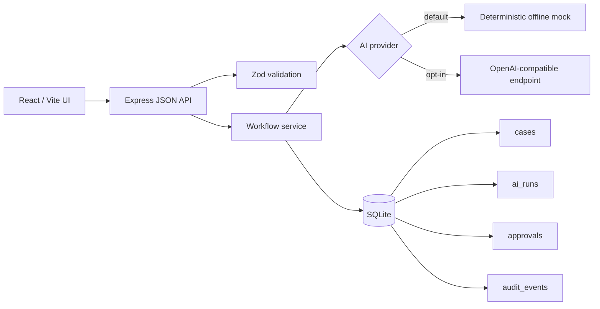

# Architecture

The API validates payloads and positive integer identifiers. The database layer owns transactions: case + audit, suggestion + status + audit, and decision + status + audit are each atomic. Generation is permitted only from `open`; decisions only from `awaiting_approval`; `approved` and `rejected` remain terminal.
